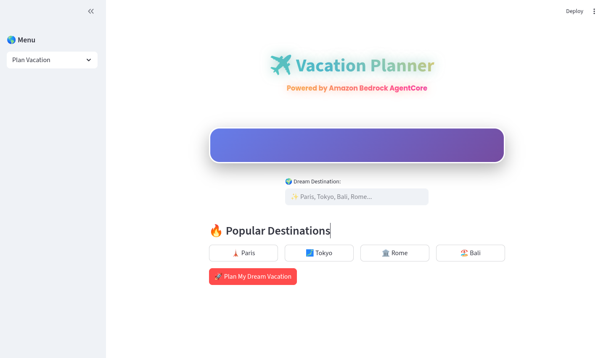
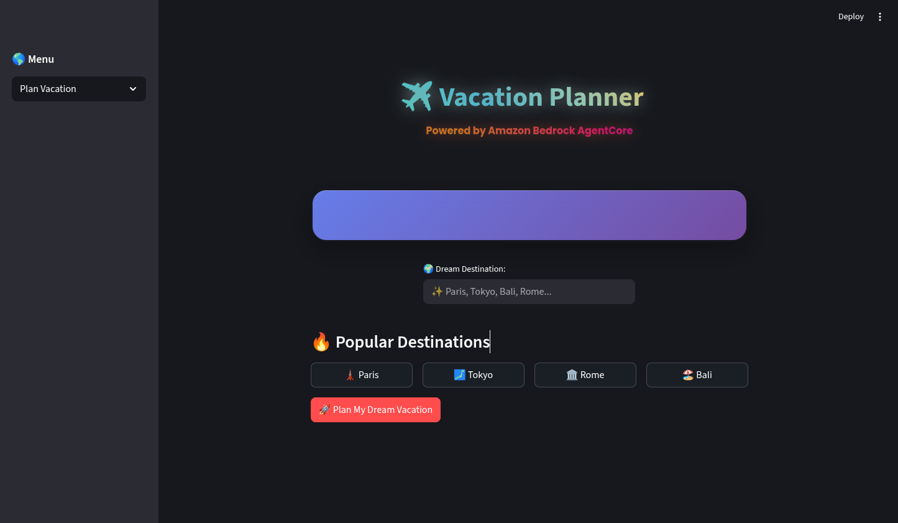

# Vacation Planner

Vacation Planner creates a destination-focused travel report using a CrewAI agent team. A Streamlit interface submits a destination to an API Gateway endpoint; the API invokes a Lambda function, which calls the deployed Amazon Bedrock AgentCore runtime.

## How It Works

1. The Streamlit app sends the chosen destination as a `prompt`.
2. The Lambda handler converts it to the `topic` payload expected by the AgentCore runtime.
3. A CrewAI researcher gathers destination information with Serper, then an itinerary planner creates a Markdown travel report using Amazon Bedrock.
4. The API response is displayed in the app. A direct crew run also writes its report to `report.md`.

## Technology

- Python 3.10-3.13 and [uv](https://docs.astral.sh/uv/) for project setup
- [CrewAI](https://docs.crewai.com/) for agent and task orchestration
- Amazon Bedrock (Nova Pro) and Bedrock AgentCore for model inference and runtime
- Serper for destination research
- Streamlit for the web interface
- AWS Lambda and API Gateway for the hosted request path

## Project Structure

```text
.
├── streamlitui.py                     # Streamlit client
├── src/vacation_planner/
│   ├── crew.py                         # CrewAI agents, tasks, and AgentCore entrypoint
│   ├── lambda_handler.py               # Lambda handler that invokes AgentCore
│   ├── main.py                         # CrewAI CLI entry points
│   ├── config/
│   │   ├── agents.yaml                 # Agent roles and goals
│   │   └── tasks.yaml                  # Research and reporting tasks
│   └── tools/                           # Custom CrewAI tools
├── knowledge/                           # Preference context for the planner
├── docs/images/                         # UI screenshots
├── tests/                               # Automated tests
├── pyproject.toml                       # Project dependencies and commands
└── requirements.txt                     # Container/runtime dependency list
```

## Run the Web App

### Prerequisites

- Python 3.10-3.13
- [uv](https://docs.astral.sh/uv/getting-started/installation/)

Install the locked project dependencies and start Streamlit:

```bash
uv sync --locked
uv run streamlit run streamlitui.py
```

The app currently posts to a deployed API Gateway URL configured in `streamlitui.py`. Running the UI uses that hosted backend; it does not start the Lambda or AgentCore runtime locally. To point the UI at another deployment, update that URL.

## AWS Runtime and Configuration

The backend uses AWS credentials available through the standard AWS SDK credential chain and requires access to the configured Bedrock model and AgentCore runtime. The researcher also needs a Serper API key:

```bash
export AWS_PROFILE=your-profile
export AWS_REGION=us-east-1
export SERPER_API_KEY=your-serper-api-key
```

Do not commit credentials or API keys. Use an AWS profile, an IAM role, or a secrets manager in deployed environments.

The Lambda entry point is `vacation_planner.lambda_handler.lambda_handler`; it expects an event such as `{"prompt": "Kyoto"}`. Its AgentCore runtime ARN and region are currently specified in `src/vacation_planner/lambda_handler.py`. Update them for a different deployment, and grant the Lambda execution role permission to invoke that runtime.

The AgentCore runtime entry point is in `src/vacation_planner/crew.py`. Note that `bedrock-agentcore` is currently listed in `requirements.txt` but not in `pyproject.toml`/`uv.lock`; the locked `uv sync` setup therefore covers the UI and tests, but not running this runtime module directly. Keep the dependency manifests aligned before relying on `uv sync` to install the runtime SDK.

This repository contains application handlers, but no AWS CDK, SAM, or Terraform infrastructure definition. The API Gateway, Lambda, and AgentCore resources must be provisioned separately.

## Develop and Test

Agent and task behavior is configured in `src/vacation_planner/config/agents.yaml` and `src/vacation_planner/config/tasks.yaml`. Crew orchestration and the AgentCore entry point live in `src/vacation_planner/crew.py`.

Run the test suite with:

```bash
uv run pytest
```

The current test suite contains a syntax smoke test; it does not make live AWS or Serper requests. CI runs dependency installation, a Python compile check, and pytest on pushes and pull requests to `main`.

## Screenshots

### Light theme



### Dark theme


